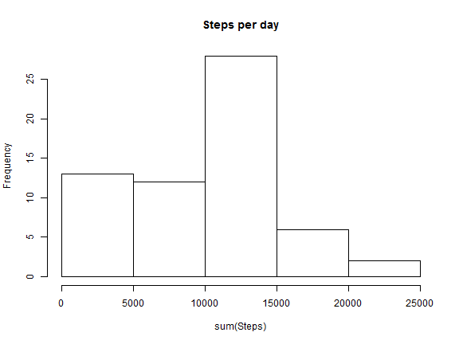
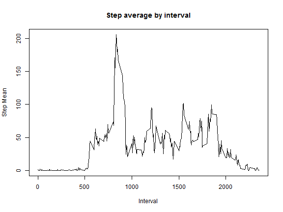
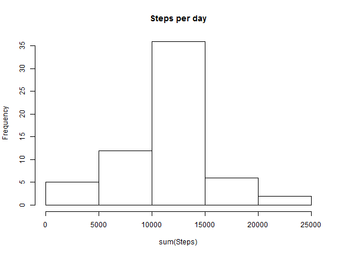
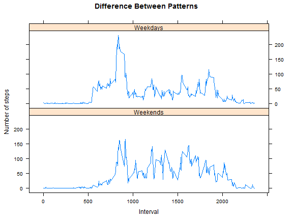

# Reproducible Research: Peer Assessment 1
First of all, we load the required libraries:


```r
library(lattice)
```


## Loading and preprocessing the data
We read the data and we cast the dates:


```r
data <- read.csv("activity.csv", stringsAsFactors = FALSE)
data$date <- as.Date(data$date, "%Y-%m-%d")
```


## What is mean total number of steps taken per day?

We calculate the sumation of the steps per day as follows (we consider the summation of NAs as 0):


```r
dataSumPerDay <- aggregate(data$steps, list(Date = data$date), sum, na.rm = T)
colnames(dataSumPerDay)[2] <- "summation"
```


In the following figure we can see the histogram of the resultant data:

```r
hist(dataSumPerDay$summation, main = "Steps per day", xlab = "sum(Steps)")
```

 


Next, we calculate the mean and the median of the summation: 

```r
meanSummation <- mean(dataSumPerDay$summation)
medianSummation <- median(dataSumPerDay$summation)
meanSummation
```

```
## [1] 9354
```

```r
medianSummation
```

```
## [1] 10395
```


## What is the average daily activity pattern?

We calculate the daily step average pattern as follows:  


```r
dataMeanPerInterval <- aggregate(data$steps, list(Date = data$interval), mean, 
    na.rm = T)
colnames(dataMeanPerInterval) <- c("interval", "meanStepPerIntervals")
```


We can see the plotting in the next figure:

```r
plot(dataMeanPerInterval$interval, dataMeanPerInterval$meanStepPerIntervals, 
    type = "l", xlab = "Interval", ylab = "Step Mean", main = "Step average by interval")
```

 


The interval with the maximum number of steps is:

```r
posMax <- match(max(dataMeanPerInterval$meanStepPerIntervals), dataMeanPerInterval$meanStepPerIntervals)
intervalMaxSteps <- dataMeanPerInterval$interval[posMax]
intervalMaxSteps
```

```
## [1] 835
```


## Imputing missing values
We will fill the missing values(NA) with the mean for that 5-minute interval.  
First we count the number of NAs:


```r
sum(is.na(data$steps))
```

```
## [1] 2304
```


Then we replace the NAs with the means and we copy it to a new data frame:


```r
tmp <- mapply(function(x, y) {
    if (is.na(x)) 
        dataMeanPerInterval$meanStepPerIntervals[match(y, dataMeanPerInterval$interval)] else x
}, data$steps, data$interval)

dataNoNA <- data
dataNoNA$steps <- tmp
```


We recalculate the step summation for each day and we plot it as we do in the first section. We can see the difference between the two histograms:


```r
dataNoNASumPerDay <- aggregate(dataNoNA$steps, list(Date = dataNoNA$date), sum, 
    na.rm = T)
colnames(dataNoNASumPerDay)[2] <- "summation"
hist(dataNoNASumPerDay$summation, main = "Steps per day", xlab = "sum(Steps)")
```

 


## Are there differences in activity patterns between weekdays and weekends?

Finally we are going to see the difference between the weekend and the weekday patterns.

First, we create a factor that splits the data in two subsets, weekend and weekdays. (I haven't used the weekdays() function because the configured language of my R studio is in Spanish):


```r
listTmp <- c("Sunday", "Monday", "Tuesday", "Wednesday", "Thursday", "Friday", 
    "Saturday")[as.POSIXlt(dataNoNA$date)$wday + 1]

dataNoNAWeeks <- cbind(dataNoNA, listTmp)
colnames(dataNoNAWeeks)[4] <- "weekday"

factorWeek <- as.factor(dataNoNAWeeks$weekday %in% c("Sunday", "Saturday"))
levels(factorWeek) <- list(Weekends = TRUE, Weekdays = FALSE)

dataNoNA <- cbind(dataNoNA, factorWeek)
```


Now, we calculate the interval average of both subsets:


```r
dataMeanIntervWeekday <- aggregate(dataNoNA$steps, list(Date = dataNoNA$interval, 
    dataNoNA$factorWeek), mean, na.rm = T)
colnames(dataMeanIntervWeekday) <- c("interval", "weekday", "averageSteps")
```


We can see the time series plot in the next figure:

```r
xyplot(averageSteps ~ interval | weekday, main = "Difference Between Patterns", 
    ylab = "Number of steps", xlab = "Interval", data = dataMeanIntervWeekday, 
    type = "l", layout = c(1, 2))
```

 

